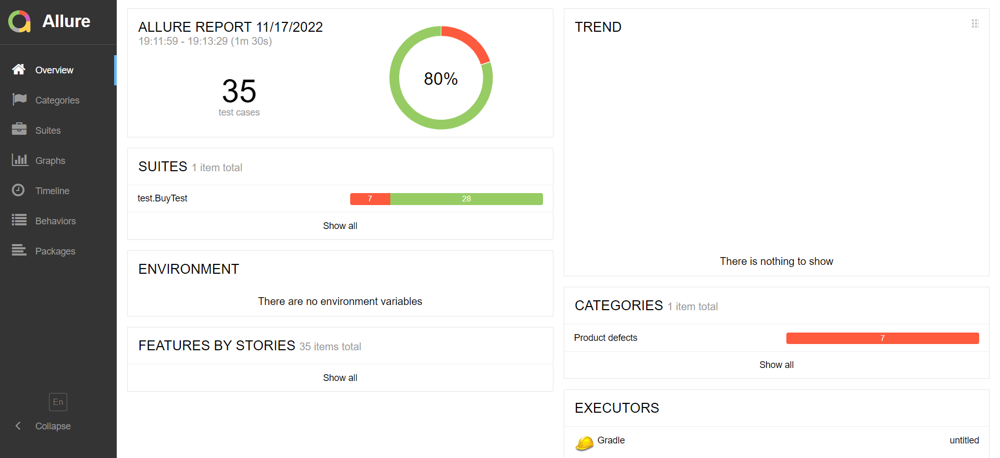

# Краткое описание
В данном проекте было проведено тестирование комплексного сервиса для покупки тура, взаимодействующего с СУБД и API банка.

# Количество тест-кейсов
Было автоматизировано 35 тест-кейсов

# Процент успешных и не успешных тест-кейсов
Из 35 тест-кейсов: 7 не прошли, 28 прошли.
Итого: 80% (успешных) / 20% (неуспешных)

# Общие рекомендации
1. В поле "Владелец" - установить ограничение на количество символов, ограничение на ввод цифр и знаков, ввод кириллицы, ввод одного слова.
2. Исправить ошибку в названии города в названии
3. Добавить ограничение на ввод нулей в поле "Месяц"

